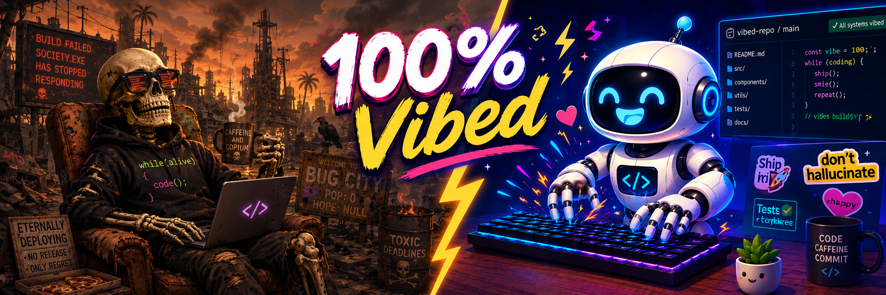

<p align="center">
  
</p>

<h1 align="center">I'll Be Backspace</h1>

<p align="center">
  <em>The comment linter that says what everybody's thinking.</em>
</p>

---

## Friend, Can We Talk About Your Comments?

Let me paint you a picture. You open a file. You're a busy person. And there,
sitting on top of a two-line function like a wedding cake on a bicycle, is
*this*:

```python
# Sync pulls files; it does NOT recreate containers. That's enough for
# config a service reads live (Traefik file-watches dynamic/, Dashy
# re-reads conf.yml per request), but a compose change needs an `up` to
# take effect. Verified 2026-07-29: fixing postgres's data mount and
# force-syncing left the same container id running the old mount, so the
# crash loop continued. Hence the two-step below.
sync(service)
compose_up(service)
```

Six lines of comment. Two lines of code. Somewhere in there is one useful fact,
and it is doing hard time.

Now — what if I told you there was a **better way**?

```console
$ backspace deploy.py
deploy.py:2:5: error: comment-code-ratio: 6 comment lines describe 2 lines of code (ratio 3.0, max 1.5)
    2 | Sync pulls files; it does NOT recreate containers. That's enough for
    3 | config a service reads live (Traefik file-watches dynamic/, Dashy
      | ... 3 more lines
    7 | crash loop continued. Hence the two-step below.
      = help: A comment longer than the code it describes usually restates the
             code. Say what the code cannot.

1 file checked, 1 violation
```

That's it. That's the product. And folks, it is **fast**.

## What's In The Box

- **Nineteen languages out of the box.** Python, Rust, Go, TypeScript,
  JavaScript, Bash, C/C++, Java, Kotlin, Swift, Ruby, PHP, Lua, SQL, YAML,
  TOML, HCL, Dockerfile, Makefile. Adding another is *one TOML file*.
- **It knows a string from a comment.** `s = "# not a comment"` does not fool
  it. Neither do raw strings, template literals, nested block comments, or
  JavaScript regex literals. This is the part everyone else gets wrong.
- **Diff-aware.** Point it at a mature repo and it won't hand you four hundred
  findings on code you didn't write. It checks what *you* touched.
- **Docstrings are safe.** Your API documentation is supposed to be long. We
  leave it alone unless you ask.
- **A `--json` mode built for robots.** Ships the offending comment text right
  in the payload, so your agent can fix it without opening the file again.
- **Configurable six ways from Sunday**, and — here's the kicker — a
  `config show` command that tells you *which layer* set every single value.
  No guessing. Never guessing.

## Get It Installed. Right Now. Today.

**Pre-commit** — and this is where it really sings:

```yaml
repos:
  - repo: https://github.com/phin-tech/ill-be-backspace
    rev: v0.1.3
    hooks:
      - id: backspace
```

**Or any of these**, whichever suits your operation:

```console
$ uvx --from ill-be-backspace backspace   # try before you buy
$ pipx install ill-be-backspace           # a wheel, no Rust required
$ brew install phin-tech/tap/backspace
```

The package is `ill-be-backspace`; the command it installs is `backspace`.

## Kick The Tires

```console
$ backspace                       # current directory, changed lines only
$ backspace src/ --all            # the whole lot
$ backspace --diff=main           # everything your branch changed
$ backspace src/ --json           # for machines
$ backspace --stats               # who's the worst offender?
```

Exit codes are `0` clean, `1` violations, `2` you've configured something
strange. Your CI will know exactly what to do.

## Two Rules Are On. The Rest Are Yours To Turn On.

| Rule | What it catches | |
|---|---|---|
| `block-too-long` | More than `max_lines` (5) consecutive lines of comment. | on |
| `comment-code-ratio` | A comment longer than the code beneath it. **This is the one that finds the real offenders.** | on |
| `comment-restates-code` | A comment that only says what the code already says. | opt-in |
| `explains-what-not-why` | A comment that restates the code *and* never says why. The sharper version of the rule above — see below. | opt-in |
| `passive-voice` | `the value is set by the caller`, where naming the actor is shorter. | opt-in |
| `uniform-sentences` | Prose where every sentence is the same length. | opt-in |
| `em-dash-habit` | Em dashes past a rate you set. | opt-in |
| `banned-phrase` | Words and regexes you pick. There's an `llm-tells` preset for `Verified 2026-…`, `Note that`, `it's not just X — it's Y`, and friends. | opt-in |
| `unapproved-word` | Prose outside a vocabulary you approve. Rough edges — see the changelog. | opt-in |

Everything opt-in stays off until you name it in `select`. We're not here to
preach.

`backspace explain <rule>` if you want the long version.

## Make It Yours

It reads config from wherever you already keep it — `.backspace.toml`,
`pyproject.toml`, `package.json`, or `Cargo.toml`. No new file unless you want
one.

```toml
max_lines = 5
exclude = ["**/vendor/**"]

[rules.banned-phrase]
preset = "llm-tells"

[languages.go]
max_lines = 8          # licence headers, we understand

[[overrides]]
paths = ["tests/**"]
max_lines = 15         # tests get a little room to breathe
```

## The One-Line Essay

A block budget can't catch this, because it's one line:

```python
# Set the user's name to the provided value if it is not None, otherwise keep the existing one.
user.name = name or user.name
```

`max_line_words` measures each line on its own:

```toml
max_line_words = 12
```

Twelve is not a number I made up. Across 907 real single-line comments, the
median is **7 words** and the 95th percentile is **12** — so this flags the top
3% and leaves everything else alone. Terse comments like
`# Cached: the upstream rate-limits at 10rps.` sail straight through.

## Just Show Me What I Wrote

Sometimes you don't want a verdict, you want a look. `--audit` lists every
comment and **always exits 0**:

```console
$ backspace --diff --audit
src/api.py:41 (line, 1 line, 18 words)
   41 | Set the user's name to the provided value if it is not None, otherwise…

src/api.py:58 (line, 2 lines, 9 words)
   58 | Retry once: the upstream 502s on cold start.
   59 | Anything longer and the client has already timed out.

1 file checked, 2 comments
```

Pair it with `--json` and hand it to your agent: "here is every comment you
just added, go read them again." That's a review aid, not a gate — which is
why it never fails a build.

## The Comment That Says Nothing

Here's the one that goes right for the throat:

```python
# increment the retry counter
retry_counter += 1
```

That comment has no job. `comment-restates-code` catches it by splitting the
identifiers below into words — `retry_counter` becomes `retry` + `counter` —
and measuring how much of the comment's vocabulary was already sitting there
in the code.

Turn it on:

```toml
select = ["block-too-long", "comment-code-ratio", "comment-restates-code"]

[rules.comment-restates-code]
threshold = 0.8      # overlap at or above this counts as restating
min_words = 6        # shorter comments have too little to measure
```

It skips section banners, code samples and data shapes, because those name the
code on purpose.

**Why it's opt-in.** A good "why" comment *has* to name the things it's talking
about, so it picks up overlap honestly. Tuned against ~7,400 real files it
fires about fifteen times, and a couple of those are arguable. It's a sharp
tool with a real false-positive rate, not a safe default — which is why you
have to ask for it.

## Why, Not What

That false-positive rate has one cause: naming the code is not the crime.
Narrating it without ever saying *why* is. So ask both questions at once:

```toml
select = ["block-too-long", "comment-code-ratio", "explains-what-not-why"]

[rules.explains-what-not-why]
threshold = 0.6      # lower than the rule above — the missing reason carries half the weight
min_lines = 2        # one line is rarely worth the argument
```

`explains-what-not-why` fires only when a comment is **all three**: at least two
lines, mostly the code's own vocabulary, and carrying none of `because`, `since`,
`so`, `otherwise`, `to avoid`, `must`, `workaround`, `upstream` — the words a
reason is made of. Say why, in any of the ways people actually say it, and the
rule leaves you alone no matter how much vocabulary you share with the code.

That conjunction is the whole point. On the same repositories where
`comment-restates-code` finds seven, this finds three — and it drops the good
"why" comments that were the other rule's false positives.

Add your own reason-words with `extend = ["rationale", "invariant"]`, or replace
the list outright with `markers = [...]`.

## Say Who Does It

```toml
select = ["passive-voice"]
```

```console
$ backspace src/
src/session.rs:88:5: error: passive-voice: passive voice: `is set by the caller`
      = help: Passive voice hides who acts. `the caller sets the value` rather
             than `the value is set by the caller`.
```

By default it only flags passives that **name their actor**, because those are
the ones with a guaranteed shorter rewrite sitting right there. `the cache is
invalidated here` is left alone: there is nobody to promote to the front of the
sentence. Measured on a 6,800-file repo, that restriction takes the rule from
3,386 findings to 361 — the rest were predicate adjectives like `is unchanged`
and `is needed`, which no rewrite improves. If you want the strict version:

```toml
[rules.passive-voice]
require_agent = false
```

It works on plain writing too: `backspace prose --select passive-voice`.

**One caution, and we mean it.** Style rules like this systematically penalise
people writing in a second language, who often write more formally and more
completely than native speakers do. Simplified Technical English was designed to
*help* that group read; enforcing its style on that same group's writing inverts
the intent. So this ships off, it ships without an `error` default in any config
we hand you, and it is a suggestion in a review — not a gate in your CI.

## MUST, SHOULD, MAY

Every finding says how hard it's pushing, because the reader is often an agent
deciding what to change:

```console
$ backspace src/
src/api.py:1:1: error: banned-phrase: matches banned phrase `utilize`
      = help: Write `use`. The shorter word is not a lesser one. [MUST fix]

src/api.py:8:1: note: banned-phrase: matches banned phrase `gate`
      = help: Check the sense: a gate is a conditional guard — `gated on the
             flag`. If you mean `controls` or `limits`, say that. [MAY leave as is]
```

`error` fails the build, `warning` reports and exits 0, `note` is a word about a
word. Some vocabulary is right in one domain and a tic in another — `gate` is a
conditional guard, `headline` is org-mode's term for a heading, `inert` is an
HTML attribute — and for those, banning is too strong and silence is too weak.
An advisory stays advice whatever severity you configure; a preset can never
hand your build an error you didn't ask for.

## The Machine Wrote This

Three tells, in descending order of how long they'll stay true.

**Punctuation.** Generated prose bolts a second thought onto a first with an em
dash, over and over:

```toml
select = ["em-dash-habit"]

[rules.em-dash-habit]
max_rate = 2.0       # per hundred words
min_count = 2        # one dash is a sentence that needed it
```

Two per hundred words is not a number we made up either. Across this repo's own
README, changelog and design notes — all hand-written, all fond of the em dash —
the highest rate is 1.3.

**Rhythm.** People write a four-word sentence next to a thirty-word one.
Generated text regresses to the mean and keeps every sentence the same size.
`uniform-sentences` measures the coefficient of variation of sentence length:

```toml
[rules.uniform-sentences]
min_variation = 0.30
min_sentences = 5    # fewer than five has no rhythm to measure
```

Same documents score 0.36 to 0.74, so 0.30 has real headroom. **An honest
caveat:** this catches unedited generated text, not edited generated text. The
design note in `docs/harper-integration.md` was written by a model and scores
0.63 — squarely human-looking — because it was revised. Treat a finding as
information, never as proof.

**Vocabulary — and here the folklore is simply wrong.** We measured every
candidate word against 4.3M words of comment prose from Neovim, Emacs and
WordPress, all written before any of this existed, and against 586k words of
agent-written code. Rates per 100k comment words:

| phrase | human | agent | |
|---|---|---|---|
| `Note that` | 26.14 | 0.51 | humans use it **50x more** |
| `In other words` | 1.05 | 0.00 | human only |
| `not only X but Y` | 0.68 | 0.00 | human only |
| `delve` | 0.05 | 0.00 | human only |
| `stomping` | 0.07 | 0.51 | 7x |
| `inert` | 0.35 | 4.95 | 14x |
| `pathological` (outside its idiom) | 0.12 | 2.22 | 19x |
| `load-bearing` | 0.00 | 6.14 | **agent only** |

So `llm-tells` finds *narration*, not authorship — worth flagging whoever wrote
it, but not evidence of anything. What actually discriminates is metaphor
standing in for a specific statement, and that's the `agent-tics` preset:

```toml
[rules.banned-phrase]
preset = ["llm-tells", "agent-tics"]
```

The control corpus earned its keep twice over. `gate` looked damning at 260 uses
until we read them — `is gated on`, `auth gate` — and `headline` appears **249
times in Emacs**, because it's org-mode's word for a heading. Neither would have
survived counting alone. Both now ship as advisories rather than bans.

And `pathological` needed a mechanism, not a verdict: Emacs uses it ten times and
every one is `pathological case`. The agent corpus stretches it over `caller`,
`span`, `scoped history`. So the entry carries an exception list and the rule
reads the *next word* before deciding.

One honest limit: the agent corpus is seven times smaller, so "human only" on a
phrase with two hits proves nothing. `Note that` isn't in that category.

All three work on writing as well as on code:

```console
$ backspace prose draft.md --select em-dash-habit
```

## Ban Your Own Words

Got a word you never want to see again? Put it in
`~/.config/ill-be-backspace.toml` and it follows you into every repo you touch:

```toml
[rules.banned-phrase]
words = ["substrate", "delve into", "leverage", "seamless", "robust"]
```

`words` are literal, not regexes — they're escaped for you, matched
whole-word and case-insensitively. So `substrate` won't fire on `substrates`,
and `c++` is a word rather than a syntax error. If you *want* a regex, use
`extend = ['Verified \d{4}-\d{2}-\d{2}']`.

### Your Words Are Safe

Here's the important part. A project **adds to** your list, it does not replace
it:

```toml
# some repo's .backspace.toml
[rules.banned-phrase]
words = ["synergy"]
```

You still get `substrate`, `delve into`, `leverage`, `seamless`, `robust` —
*plus* `synergy`. The only thing that wipes your list is a project explicitly
saying `patterns = [...]`, which is the documented "start from scratch" switch.

| key | takes | what it does |
|---|---|---|
| `words` | plain text | escaped, whole-word, case-insensitive — **start here** |
| `extend` | regex | appended to whatever's accumulated |
| `patterns` | regex | **replaces** the accumulated list |
| `preset` | `"llm-tells"` | the built-in bundle |

## Who Set What, And Where

Values stack up in this order, each one beating the last:

```
defaults → ~/.config/ill-be-backspace.toml → project config
         → [languages.*] → [[overrides]] → CLI flags → inline directives
```

Every layer only changes the keys it names. Set `max_lines` in a project and
your personal `require_suppression_reason` still applies.

And when you can't remember why a value is what it is, just ask:

```console
$ backspace config show src/api/handlers.py
src/api/handlers.py  (python)
  user config:    /Users/you/.config/ill-be-backspace.toml
  project config: .backspace.toml

  max_lines                  = 15            overrides[0]
  max_ratio                  = 1.50          default
  banned_phrases             = 6 pattern(s)  user config
  severity                   = error         command line
```

No guessing. Never guessing.

Full schema in [`skill/reference.md`](skill/reference.md).

## Sometimes The Long Comment Is Right

Wire formats. Protocol quirks. We're reasonable people:

```python
# backspace: ignore[block-too-long] — frame layout is fixed by RFC 9114 §4.2
```

`backspace: ignore` for everything, `backspace: ignore-file` near the top of a
file for the whole thing. Set `require_suppression_reason = true` and it'll
insist you explain yourself — which, frankly, you should.

## For The Robots

There's a Claude Code skill in [`skill/`](skill/). Drop it in and your agent
writes shorter comments *in the first place*, which beats catching them at
commit time every day of the week:

```console
$ cp -r skill ~/.claude/skills/backspace
```

### Catch It In Flight

Two hooks in [`hooks/`](hooks/) move the check earlier still — from commit time
to the moment the words are written. Copy
[`.claude/settings.json.example`](.claude/settings.json.example) into
`.claude/settings.json`:

- **`backspace-hook.sh`** (`PostToolUse` on `Write|Edit`) — checks each file the
  moment it's edited and hands the findings straight back to the agent, so the
  comment gets fixed before anyone reads it. In a git repo it uses `--diff`, so
  it only reports comments from the current session, not every legacy comment in
  a file the agent happened to open.
- **`backspace-chat-hook.sh`** (`Stop`) — runs your word list over the agent's
  *own reply to you*. If you never want to read the word "substrate", it should
  not reach you through chat either.

Both surface findings as context by default rather than blocking, because
comment length is a judgement call. Set `BACKSPACE_BLOCK=1` or
`BACKSPACE_CHAT_BLOCK=1` if you'd rather they insist.

One honest caveat on the chat hook: a `Stop` block forces another turn, it does
not edit the message you already read. So blocking mode costs a round trip to
fix wording after the fact — the non-blocking default, which teaches the agent
for the *next* message, is usually the better trade.

### Lint Any Prose

The same word list works on plain writing, no source file required:

```console
$ echo "Let us delve into the substrate." | backspace prose
<stdin>:1:1: error: banned-phrase: matches banned phrase `substrate`
```

That's what the chat hook uses under the hood.

## Under The Hood

A clanker-rolled character state machine, one pass, no parser generators, no
grammar downloads. Language definitions are plain TOML embedded at compile time
— and you can add your own at *runtime*, same schema, no recompile.

Two things it's honest about: JavaScript regex-literal detection and Python
docstring position are heuristics, not a parser. They're tested against the
cases that matter and documented where they aren't perfect.

256 tests. It passes its own lint. We wouldn't dare ship it otherwise.

## What Changed

Every release is written up in [`CHANGELOG.md`](CHANGELOG.md), including the
rules that moved and the defaults that shifted.

While we're below 1.0, thresholds may change in a minor release — but a **new
rule always ships switched off**, so upgrading will never start failing a build
that passed yesterday.

## Contributing

New language? One file in `languages/`, one line in `src/lang/mod.rs`, a
`good_` and a `bad_` fixture in `tests/fixtures/`. That's the whole ceremony.

```console
$ cargo test
$ prek run --all-files
```

Adding a rule or changing a default? Add a line to
[`CHANGELOG.md`](CHANGELOG.md) under `## [Unreleased]` while it's still fresh.

## License

MIT. Go build something.
